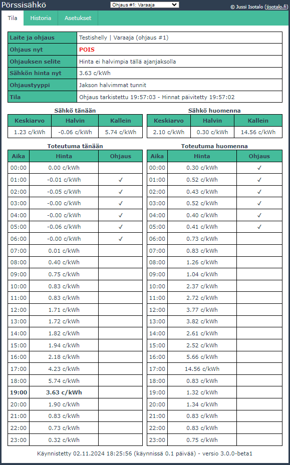
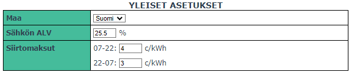
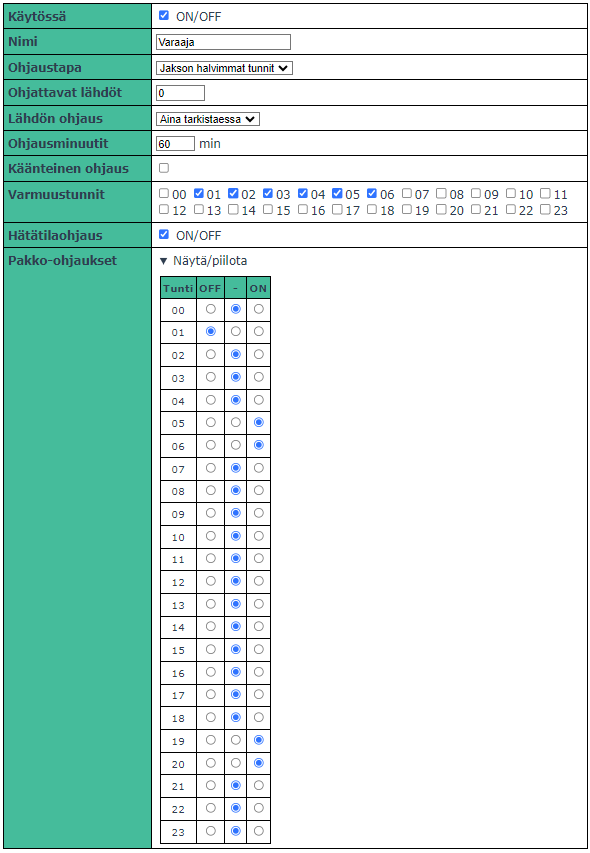

# shelly-porssisahko - Pörssisähköohjaus Shelly-releisiin
[](https://choosealicense.com/licenses/agpl-3.0/)
[](https://github.com/jisotalo/shelly-porssisahko)

 --------
 
**HUOM: TÄMÄ ON V.3 TESTIVERSIO**

```
[3.0.0-beta1] - 02.11.2024
- Tuki kolmelle yhtäaikaiselle ohjaukselle
  - Jokaiselle voidaan määrittää omat asetukset ja lähdöt
  - Käyttöliittymässä valitaan, minkä ohjuksen tilaa, historiaa ja asetuksia käytetään.
- Maan valinta (tulevaa englanninkielistä versiota varten)
- Oletus-ALV muutettu 25.5%
- Pieniä parannuksia ja optimointeja konepellin alla
```

 --------

Shelly-laitteisiin selaimella ohjattava ilmainen avoimen lähdekoodin pörssisähkösovellus. Skripti pyörittää käyttöliittymää omalla web-serverillä ja tallentaa asetukset Shellyn muistiin.

Skripti käyttää suoraan Viron kantaverkkoyhtiö [Eleringin](https://dashboard.elering.ee/api) rajapintaa, eli välissä ei ole muita palveluita. Näin ollen rekisteröitymistä ei tarvita, vaan kaikki toimii "suoraan paketista".

Jos haluat ohjata Shelly Plug Plus -laitteen valon väriä sähkön hinnan mukaan, tsekkaa [shelly-plug-nordpool-light](https://github.com/jisotalo/shelly-plug-nordpool-light).



## Ominaisuudet
* Ilmainen + avoin lähdekoodi
* Oma web-serveri Shellyn sisällä ja siinä pyörivä käyttöliittymä
* Ei rekisteröitymistä
* Valvonta ja konfigurointi nettiselaimen avulla kotiverkossa (PC, puhelin, tabletti)
* Mahdollista luoda jopa kolme mahdollista yhtäaikaista ohjausta, kuten eimerkiksi
  * vaarajan lämmityksen ohjaus vuorokauden halvimmilla tunneilla
  * lattialämmityksen ohjaus illan halvimmilla tunneilla
  * ulkovalojen ohjaus, jos tarpeeksi halpa sähkö
* Nykyisen ja seuraavan päivän hinnat sekä toteutuva ohjaus näkyvillä
* Kolme ohjaustapaa: 
  * **käsiohjaus** - yksinkertaisesti ohjaus päälle/pois
  * **hintaraja** - jos hinta on alle rajan, laitetaan ohjaus päälle 
  * **jakson halvimmat tunnit** - valitaan halutuilta aikajaksolta x halvinta tuntia
* Mahdollisuus ohjata osatunteja
* Pakko-ohjaus väliaikaisesti tai aina tietyille tunneille (ohjaus päälle tai pois)
* Vikasietoinen
  * Varmuustunnit (jos ei hintoja mutta tiedetään kellonaika)
  * Hätätilaohjaus (jos ei internet-yhteyttä eikä tiedetä kellonaikaa)
* Konfiguroitavuus ja hienosäätö mahdollista omilla skripteillä

## Sisällysluettelo
  - [Muutoshistoria](#muutoshistoria)
  - [Tukeminen](#tukeminen)
  - [Asennus](#asennus)
    - [Asennus kirjaston avulla (suositeltu tapa)](#asennus-kirjaston-avulla-suositeltu-tapa)
    - [Asennus käsin](#asennus-käsin)
  - [Skriptin päivitys](#skriptin-päivitys)
  - [Laitteisto ja sähköinen kytkentä](#laitteisto-ja-sähköinen-kytkentä)
  - [Asetukset](#asetukset)
    - [Yleiset asetukset](#yleiset-asetukset)
    - [Ohjauskohtaiset asetukset](#ohjauskohtaiset-asetukset)
      - [Yleiset](#yleiset)
      - [Käsiohjaus](#käsiohjaus)
      - [Hintaraja](#hintaraja)
      - [Jakson halvimmat tunnit](#jakson-halvimmat-tunnit)
    - [Jakson halvimmat tunnit - omavalintaiset jaksot](#jakson-halvimmat-tunnit---omavalintaiset-jaksot)
    - [Toiminnot](#toiminnot)
  - [Lisätoiminnot ja omat skriptit](#lisätoiminnot-ja-omat-skriptit)
  - [Kysymyksiä ja vastauksia](#kysymyksiä-ja-vastauksia)
    - [Miksi välillä tulee HTTP error 503?](#miksi-välillä-tulee-http-error-503)
    - [Miten ohjaan ainoastaan yön halvimmilla tunneilla?](#miten-ohjaan-ainoastaan-yön-halvimmilla-tunneilla)
    - [Miten saan lähdön päälle aina jos sähkön hinta on keskiarvon alapuolella?](#miten-saan-lähdön-päälle-aina-jos-sähkön-hinta-on-keskiarvon-alapuolella)
    - [Miksi laitteen nimen kohdalla lukee "Ei asetettu"?](#miksi-laitteen-nimen-kohdalla-lukee-ei-asetettu)
    - [Kuinka saa skriptin toimimaan Switch Add-Onin kanssa?](#kuinka-saa-skriptin-toimimaan-switch-add-onin-kanssa)
    - [Milloin seuraavan päivän hinnat haetaan? Miksi hintoja ei näy vaikka kello on 14?](#milloin-seuraavan-päivän-hinnat-haetaan-miksi-hintoja-ei-näy-vaikka-kello-on-14)
  - [Teknistä tietoa ja kehitysympäristö](#teknistä-tietoa-ja-kehitysympäristö)
  - [License](#license)

## Muutoshistoria

Katso päivitysten sisältö [CHANGELOG.md-tiedostosta](https://github.com/jisotalo/shelly-porssisahko/blob/master/CHANGELOG.md).

Tarvittaessa vanhat skriptiversiot löytyvät [Releases](https://github.com/jisotalo/shelly-porssisahko/releases)-sivulta. Lataa halutun version zip-tiedosto, ja kopioi `dist/shelly-porssisahko.js`-tiedoston sisältö.


## Tukeminen

Jos skriptistä on hyötyä, voit vaikka tarjota kahvit vastineena! Tämä on puhtaasti harrastuspohjalta tehty.

<a href="https://www.buymeacoffee.com/jisotalo" target="_blank"></a>

[](https://www.paypal.com/donate/?business=KUWBXXCVGZZME&no_recurring=0&currency_code=EUR)
 
## Asennus

**HUOMIO:** Skripti vaatii firmwaren 1.0.7 tai uudemman

### Asennus kirjaston avulla (suositeltu tapa)

1. Ota Shelly käyttöön, yhdistä se wifi-verkkoon ja päivitä sen firmware. Avaa Shellyn hallinta **nettiselaimella**.

2. Laita **Websocket debug** päälle (Settings -> Debug -> Enable websocket debug). Näin näet suoraan hallintapaneelin osoitteen skriptin alla.
3. Avaa **Scripts**-sivu Shellyn hallinnasta. Poista olemassaolevat skriptit, jos niitä on.
4. Paina **Library**-painiketta

    

5. Aukeavassa ikkunassa paina **Configure URL**

    

6. Syötä osoitteeksi `https://raw.githubusercontent.com/jisotalo/shelly-porssisahko/refs/heads/dev-v3/shelly-library.json` ja paina **Save** (**HUOM: v3 testiversiolla on eri osoite!**)

    

7. Nyt kirjastoon ilmestyy pörssisähköohjaus. Asenna se painamalla **Import code**

    

8.  Kun skripti ilmestyy, paina **Save**

    

9.  Tallentamisen jälkeen paina **Start**, jolloin skripti käynnistyy

    

10. Jos websocket debug on päällä (**kohta 2**), näet hallinnan osoitteen suoraan skriptin alla konsolissa. Kopioi tämä osoite ja avaa se selaimella. Jos et näe sitä niin osoite on muotoa `http://ip-osoite/script/1`


    

11. Varmista vielä että skripti käynnistyy aina automaattisesti. Eli **Scripts**-sivulla pitää shelly-porssisahko.js -skriptin kohdalla olla valinta päällä.

    

12. Valmis! Avaa käyttöliittymä selaimessa (**kohta 10**) ja säädä asetukset kohdilleen [Asetukset](#asetukset) ja [Valmiita esimerkkiasetuksia](#valmiita-esimerkkiasetuksia) -kappaleiden ohjeilla.

### Asennus käsin

Jos haluat asentaa skriptin käsin, Shelly Smart Control -sovelluksella tai [control.shelly.cloud](https://control.shelly.cloud) -pilvipalvelun kautta, löydät skriptin osoitteesta [https://raw.githubusercontent.com/jisotalo/shelly-porssisahko/dev-v3/dist/shelly-porssisahko.js](https://raw.githubusercontent.com/jisotalo/shelly-porssisahko/dev-v3/dist/shelly-porssisahko.js). 

Seuraa ylläolevia ohjeita pääpirteittäin, mutta kopioi skriptin sisältö Shellyyn sellaisenaan, kirjaston käytön sijaan.

## Skriptin päivitys

Jos haluat päivittää skriptin uusimaan versioon, poista nykyinen skripti ja tee asenna uusi **Library**-painikkeen kautta. Kaikki asetukset säilyvät. Voit myös päivittää sen käsin (katso [Asennus käsin](#asennus-käsin)).

**HUOMIO:** Tämän jälkeen skripti ei enää välttämättä käynnisty automaattisesti. Päivitä **Scripts**-sivu (esim. painamalla F5 selaimessa) ja laita skripti käynnistymään automaattisesti uudelleen (kuten asennusohjeiden kohdassa 11).

## Laitteisto ja sähköinen kytkentä

Uskallan suositella Shelly-tuotteiden ostoa [Nurkan Takaa -kaupasta](https://verkkokauppa.nurkantakaa.fi/), sillä omien kokemuksien perusteella homma toimii erittäin luotettavasti ja hinnat ovat Suomen alhaisimmat. 

Olen kehittänyt tämän skriptin alunperin Shelly Plus 1PM -relekytkimelle. Jos ohjaat kontaktoria, on suositeltavaa käyttää Shellyn sinisiä laitteita, jotka kestävät paremmin kelan aiheuttamia kytkentäpiikkejä. Näitä ovat esimerkiksi:

* [Shelly Plus 1](https://verkkokauppa.nurkantakaa.fi/tuote/shelly-plus-1/)
* [Shelly 1 Mini](https://verkkokauppa.nurkantakaa.fi/tuote/shelly-plus-1-mini-gen-3/)
* [Shelly Pro 1, 2 ja 3](https://verkkokauppa.nurkantakaa.fi/osasto/shelly/shelly-pro/)

Jos kuitenkin käytät esim. Shelly Plus 1PM -laitetta kontaktorin kanssa, [RC-suodatin](https://verkkokauppa.nurkantakaa.fi/tuote/rc-snubber/) voi auttaa. Jännitepiikit ovat tunnetusti aiheuttaneet laitteen yllättävää uudelleenkäynnistystä.

Lisää hyvää tietoa löytyy [Shelly tuki (suomeksi)](https://www.facebook.com/groups/shellytuki) -ryhmästä.

Skripti toimii tunnetusti ainakin seuraavilla:
  * Shelly Plus 1PM
  * Shelly Plus 2PM
  * Shelly Plus 1
  * Shelly Pro 1
  * Shelly Pro 2
  * Shelly Pro 3
  * Shelly Pro 4PM
  * Shelly Pro3EM + Switch Add-on
  * Shelly Plus UNI
  * Shelly Plus 1 Mini
  * Shelly Plus Plug S
    * Plugin valon värin ohjaus sähkön hinnan mukaan onnistuu skriptillä [shelly-plug-nordpool-light](https://github.com/jisotalo/shelly-plug-nordpool-light)


## Asetukset

### Yleiset asetukset

Nämä asetukset ovat voimassa kaikille ohjauksille.


| Asetus       | Selite                                                                                                                                                                                                        | Esim. (kuva yllä)       |
| ------------ | ------------------------------------------------------------------------------------------------------------------------------------------------------------------------------------------------------------- | ----------------------- |
| Maa          | Maa, jonka sähkön hinnat haetaan                                                                                                                                                                              | `Suomi`                 |
| Sähkön ALV   | Käytettävä ALV-% sähkön hinnalle. [%]                                                                                                                                                                         | `25.5`                  |
| Siirtomaksut | Jos haluat että siirtomaksut otetaan huomioon, voit syöttää ne päivä- ja yöajalle. Nämä lisätään tuntihintoihin. [c/kWh]<br><br>Esim. jos haluat ottaa erisuuruiset siirtomaksut huomioon tuntien valinnassa. | päivä: `4` <br> yö: `3` |

Nämä asetukset ovat voimassa kaikilla ohjaustavoilla.

### Ohjauskohtaiset asetukset

Nämä ovat voimassa valitulle ohjaukselle. Käsiteltävä ohjaus valitaan sivun ylälaidan alasvetovalikosta.




#### Yleiset

| Asetus            | Selite                                                                                                                                                                                                                                                                                                                                                                                                                                                                                                                                                            | Esim. (kuva yllä)                                               |
| ----------------- | ----------------------------------------------------------------------------------------------------------------------------------------------------------------------------------------------------------------------------------------------------------------------------------------------------------------------------------------------------------------------------------------------------------------------------------------------------------------------------------------------------------------------------------------------------------------- | --------------------------------------------------------------- |
| Käytössä          | Onko valittu ohjaus käytössä.                                                                                                                                                                                                                                                                                                                                                                                                                                                                                                                                     | `ON`                                                            |
| Ohjaustapa        | Millä ohjaustavalla lähtöä ohjataan.<br><br>Selitykset taulukon alapuolella.                                                                                                                                                                                                                                                                                                                                                                                                                                                                                      | `jakson halvimmat tunnit`                                       |
| Ohjattavat lähdöt | Shellyn ohjattavien lähtöjen ID-numerot.<br><br>Jos useampi lähtö, erota pilkulla (max. 4 kpl). <br><br>- Yksi lähtö  (mm. Shelly Plus 1) --> `0`.<br>- Useampi (esim 0, 1 ja 100) --> `0,1,100`                                                                                                                                                                                                                                                                                                                                                                  | `0`                                                             |
| Lähdön ohjaus     | Ohjataanko relelähtö aina haluttuun tilaan vai ainoastaan jos tila muuttuu.<br><br>- **Aina tarkistaessa:** Lähtö ohjataan joka tarkistuksen jälkeen (eli yleensä kerran tunnissa) haluttuun tilaan ja Shellyn sovelluksen tai hallintapaneelin kautta tehty muutos ylikirjoitetaan.<br>- **Vain muuttuessa:** Lähtö ohjataan ensimmäisellä kerralla haluttuun tilaan ja sen jälkeen ainoastaan sen muuttuessa.                                                                                                                                                   | `aina tarkistaessa`                                             |
| Ohjausminuutit    | Määrittää kuinka monta minuuttia tunnista ohjaus on päällä. Jos tunti on turhan pitkä aika pitää lähtöä päällä, voidaan aika muuttaa lyhyemmäksi. Asetus vaikuttaa kaikkiin ohjauksiin, pois lukien pakko-ohjaus käsin. [min]<br><br>Esim. 30 minuuttia riittää aina varaajan lämmittämiseen, joten pidetään vain tunnin ensimmäiset 30 minuuttia ohjausta päällä.                                                                                                                                                                                                | `60`                                                            |
| Käänteinen ohjaus | Jos ruksittu, ohjaus toimii käänteisesti normaaliin nähden. Tällöin lähtökohta on, että lähtö on päällä.<br><br>- **Varmuustunnit**: Lähtö ohjataan varmuustunneilla pois päältä<br>- **Hätätilaohjaus**: Lähtö on päinvastainen asetukseen nähden<br>- **Pakko-ohjaukset**: Lähtö voidaan pakko-ohjata pois päältä<br>- **Käsiohjaus**: Lähtö on päinvastainen asetukseen nähden<br>- **Hintaraja**: Jos hinta on alle rajan, lähtö asetetaan pois päältä<br>- **Jakson halvimmat tunnit**: Jos nykyinen tunti on halvimpia tunteja, lähtö asetetaan pois päältä | `ei`                                                            |
| Varmuustunnit     | Jos sähkön hintaa ei jostain syystä tiedetä, ohjataan lähtö näillä tunneilla päälle.<br><br>Esim. ongelma hintojen haussa tai nettiyhteys katkeaa.                                                                                                                                                                                                                                                                                                                                                                                                                | `01:00-07:00`                                                   |
| Hätätilaohjaus    | Jos Shelly ei jostain syystä tiedä kellonaikaa, ohjataan lähtö tähän tilaan varmuuden vuoksi.<br><br>Esim. jos sähkökatkon jälkeen nettiyhteys ei palaudu (ei hintoja eikä kellonaikaa).                                                                                                                                                                                                                                                                                                                                                                          | `ON`                                                            |
| Pakko-ohjaukset   | Voidaan määrittää tunnit, jolloin ohjaus asetetaan joko päälle tai pois riippumatta sähkön hinnasta ja muista ohjauksista (pl. pakko-ohjaus käsin).<br><br>Esim. jos haluat lämmittää varajaa joka aamu tai estää ohjauksen tiettynä osana vuorokaudesta.                                                                                                                                                                                                                                                                                                         | `05:00-07:00` ja `19:00-21:00` päällä<br><br>`01:00-02:00` pois |

#### Käsiohjaus

Voimassa, jos valittu ohjaustapa on käsiohjaus.

Käsiohjauksella lähtö ohjataan käyttöliittymältä asetettuun tilaan.


| Asetus | Selite                            | Esim. (kuva yllä) |
| ------ | --------------------------------- | ----------------- |
| Ohjaus | Asetetaanko lähtö päälle vai pois | `ON`              |

#### Hintaraja

Voimassa, jos valittu ohjaustapa on hintaraja.

Hintarajaohjauksella lähtö asetetaan päälle jos sähkön hinta on alle määritellyn rajan (tai juuri sen verran).


| Asetus    | Selite                                                                                                                                             | Esim. (kuva yllä) |
| --------- | -------------------------------------------------------------------------------------------------------------------------------------------------- | ----------------- |
| Hintaraja | Hinta, jossa ja jonka alla lähtö asetetaan päälle. [c/kWh]<br><br>Voit syöttää tähän myös arvon `avg`, jolloin käytetään päivän hinnan keskiarvoa. | `4.25`            |

#### Jakson halvimmat tunnit

Voimassa, jos valittu ohjaustapa on jakson halvimmat tunnit.

Jakson halvimmat tunnit -ohjauksella vuorokausi jaetaan osiin. Lähtö ohjataan päälle jokaisen osan halvimmmilla tunneilla. Lisäksi voidaan määrittää raja jonka alla ohjaus on aina päällä.


| Asetus            | Selite                                                                                                                                                                                                                                                                                                                                                            | Esim. (kuva yllä) |
| ----------------- | ----------------------------------------------------------------------------------------------------------------------------------------------------------------------------------------------------------------------------------------------------------------------------------------------------------------------------------------------------------------- | ----------------- |
| Ajanjakso         | Minkä mittaisiin jaksoihin vuorokausi jaetaan. Jokaiselta jaksolta haetaan sitten halvimmat tunnit. [h]<br><br>Vaihtoehtona on myös `oma valinta`. Tällöin kellonajat voidaan syöttää itse. Katso lisätietoa kappaleesta [Jakson halvimmat tunnit - omavalintaiset jaksot](#jakson-halvimmat-tunnit---omavalintaiset-jaksot) | `6`               |
| Tuntimäärä        | Kuinka monta halvinta tuntia lähtö ohjataan päälle ajanjakson aikana.<br><br>Eli jos ajanjakso on 6h ja tuntimäärä 2, kello 00:00-06:00 lähtö ohjataan päälle kahtena halvimpana tuntina. Kuten myös kello 06:00-12:00 ja niin edelleen.                                                                                                                          | `2`               |
| Peräkkäiset       | Jos käytössä, valitaan jakson tunnit siten että ne ovat peräkkäin.<br><br>Näin yksittäisiä halvimpia tunteja ei välttämättä hyödynnetä, mutta halvin mahdollinen yhtenäinen jakso otetaan käyttöön. Katso esimerkki alta.                                                                                                                                         | `ei`              |
| Aina päällä -raja | Jos sähkö on tätä halvempaa (tai juuri tämän hintaista) niin lähtö on aina päällä. [c/kWh]<br><br>Voit syöttää tähän myös arvon `avg`, jolloin käytetään päivän hinnan keskiarvoa.                                                                                                                                                                                | `-0.5`            |
| Maksimihinta      | Jos sähkön hinta on tätä korkeampi, lähtöä ei aseteta päälle vaikka tunti olisikin halvimpia tunteja. [c/kWh]<br><br>Voit syöttää tähän myös arvon `avg`, jolloin käytetään päivän hinnan keskiarvoa.<br><br>*Tämän kanssa pitää olla tarkkana, jos tulee kalliita päiviä.*                                                                                       | `30`              |

Alla esimerkki miten ohjaukset toteutuivat 12.10.2023 hinnoilla ja yllä olevilla asetuksilla (6h, 2 halvinta tuntia, aina päällä -raja -0.5 c/kWh). Huomaa jaksojen korostus taustavärillä.


Alla on havainnollistettu **peräkkäiset**-asetuksen vaikutusta. Esimerkkikuvissa asetuksena on 4h ajanjakso ja tuntimäärä 3.

**Ei käytössä (oletusarvo):**

Valitaan kolme halvinta tuntia.


**Käytössä:**

Valitaan kolme perättäistä tuntia. Valitaan kello 17-19 koska niiden hinnan keskiarvo on pienempi kuin kello 16-18.


### Jakson halvimmat tunnit - omavalintaiset jaksot

Versiosta 2.12.0 lähtien voidaan vaihtoehtoisesti syöttää yksi tai kaksi omavalintaista jaksoa tuntimäärineen. Tämän avulla saadaan helposti tehtyä esimerkiksi "*kolme halvinta tuntia yöllä kello 00-06 väliltä ja yksi halvin tunti illalla kello 18-21 väliltä*" -tyylinen ohjaus.

Valittaessa ajanjaksoksi `oma valinta`, voidaan syöttää halutut kellonajat ja tuntimäärät alla olevan kuvan mukaisesti.


Tällöin ohjaus voisi mennä esimerkiksi seuraavasti:

 

### Toiminnot


* **Pakko-ohjaus**
  * Painamalla tätä voit asettaa lähdön päälle tai pois määritellyksi ajaksi
  * Syötä kysyttäessä kuinka monta tuntia pakko-ohjaus on käytössä sekä haluttu lähdön tila (voit syöttää myös osatunteja, esim. `0.5` on puoli tuntia)
* **Shelly**
  * Avaa uudessa välilehdessä Shellyn oman hallintasivun

## Lisätoiminnot ja omat skriptit

Ei vielä saatavilla v3 testiversiossa.

## Kysymyksiä ja vastauksia

### Miksi välillä tulee HTTP error 503?

Kun skripti hakee hintoja tai suorittaa ohjauslogiikkaa, vastataan kaikkiin HTTP-pyyntöihin 503 (Service Unavailable) muistin säästämiseksi.
Käyttöliittymä osaa hallita tämän.

Tämä virhe voi joskus tulla ja se on ominaisuus. Kokeile avata sivu uudelleen.

### Miten ohjaan ainoastaan yön halvimmilla tunneilla?

Valitse ajanjaksoksi `oma valinta (1 jakso)` ja aseta asetukset. Katso [Jakson halvimmat tunnit - omavalintaiset jaksot](#jakson-halvimmat-tunnit---omavalintaiset-jaksot).

### Miten saan lähdön päälle aina jos sähkön hinta on keskiarvon alapuolella?

Valitse ohjaustavaksi `hintaraja` ja aseta hintarajaksi arvon `avg`.

### Miksi laitteen nimen kohdalla lukee "Ei asetettu"?

Et ole asettanut laitteelle nimeä Shellyn hallinnasta. Nimen voit asettaa `Settings` -> `Device name` alta. 

Huomaa, että tehdasasetuksena nimen kohdalla lukee lukee laitteen malli. Tämä näkyy silti pörssisähköskriptille tyhjänä.

### Kuinka saa skriptin toimimaan Switch Add-Onin kanssa?

Testattu Shelly Pro3EM + Switch Add-on.

Kun olet asentanut add-onin, näet lähdön numeron Shellyn hallinnassa. Alla olevassa esimerkissä lähdön numero on `100`.


Muuta skriptin asetuksista `ohjattavat lähdöt` kyseiseen arvoon, jolloin ohjaus toimii.

### Milloin seuraavan päivän hinnat haetaan? Miksi hintoja ei näy vaikka kello on 14?

Seuraavan päivän hinnat haetaan kello 15. Elering tarjoaa uudet hinnat n. 14:30 alkaen.

## Teknistä tietoa ja kehitysympäristö

*TODO*

## License

GNU Affero General Public License v3.0 - [LICENSE.txt](https://github.com/jisotalo/shelly-porssisahko/blob/master/LICENSE.txt)

Huomaathan, että projekti on täysin harrasteena tehty, eikä siinä ole lisenssin mukaisesti mitään takuuta. Näin ollen tekijä ei ole vastuussa jos sen käytön kanssa on ongelmia.

Käytetty välilehtiratkaisu pohjautuu esimerkkiin [täältä](https://alvarotrigo.com/blog/html-css-tabs/).