# shelly-porssisahko - Pörssisähköohjaus Shelly-releisiin
[](https://choosealicense.com/licenses/agpl-3.0/)
[](https://github.com/jisotalo/shelly-porssisahko)


Shelly-laitteisiin selaimella ohjattava ilmainen avoimen lähdekoodin pörssisähkösovellus. Skripti pyörittää käyttöliittymää omalla web-serverillä ja tallentaa asetukset Shellyn muistiin.

Skripti käyttää suoraan Viron kantaverkkoyhtiö [Eleringin](https://dashboard.elering.ee/api) rajapintaa, eli välissä ei ole muita palveluita. Näin ollen rekisteröitymistä ei tarvita, vaan kaikki toimii "suoraan paketista".

Jos haluat ohjata Shelly Plug Plus -laitteen valon väriä sähkön hinnan mukaan, tsekkaa [shelly-plug-nordpool-light](https://github.com/jisotalo/shelly-plug-nordpool-light).

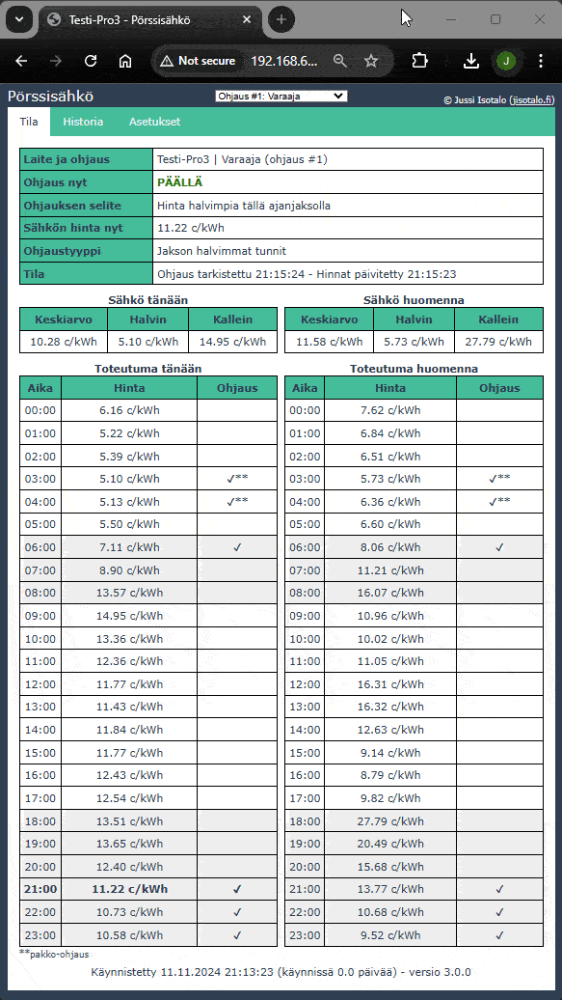

## Ominaisuudet
* Ilmainen + avoin lähdekoodi
* Oma web-serveri Shellyn sisällä ja siinä pyörivä käyttöliittymä
* Ei rekisteröitymistä
* Valvonta ja konfigurointi nettiselaimen avulla kotiverkossa (PC, puhelin, tabletti)
* Mahdollista luoda jopa kolme mahdollista yhtäaikaista ohjausta eri säännöillä
* Nykyisen ja seuraavan päivän hinnat sekä toteutuva ohjaus näkyvillä
* Kolme erilaista ohjaustapaa
* Mahdollisuus ohjata osatunteja
* Pakko-ohjaus väliaikaisesti tai aina tietyille tunneille (ohjaus päälle tai pois)
* Vikasietoinen
  * Varmuustunnit (jos ei hintoja mutta tiedetään kellonaika)
  * Hätätilaohjaus (jos ei internet-yhteyttä eikä tiedetä kellonaikaa)
* Konfiguroitavuus ja hienosäätö mahdollista omilla skripteillä

## Sisällysluettelo
- [shelly-porssisahko - Pörssisähköohjaus Shelly-releisiin](#shelly-porssisahko---pörssisähköohjaus-shelly-releisiin)
  - [Ominaisuudet](#ominaisuudet)
  - [Sisällysluettelo](#sisällysluettelo)
  - [Muutoshistoria](#muutoshistoria)
    - [Edellinen v.2-versio](#edellinen-v2-versio)
  - [Tukeminen](#tukeminen)
  - [Asennus](#asennus)
    - [Asennus kirjaston avulla (suositeltu tapa)](#asennus-kirjaston-avulla-suositeltu-tapa)
    - [Asennus käsin](#asennus-käsin)
  - [Skriptin päivitys](#skriptin-päivitys)
  - [Laitteisto ja sähköinen kytkentä](#laitteisto-ja-sähköinen-kytkentä)
  - [Asetukset](#asetukset)
    - [Yleiset asetukset](#yleiset-asetukset)
    - [Ohjauskohtaiset asetukset](#ohjauskohtaiset-asetukset)
      - [Yleiset](#yleiset)
      - [Käsiohjaus](#käsiohjaus)
      - [Hintaraja](#hintaraja)
      - [Jakson halvimmat tunnit](#jakson-halvimmat-tunnit)
    - [Jakson halvimmat tunnit - omavalintaiset jaksot](#jakson-halvimmat-tunnit---omavalintaiset-jaksot)
    - [Toiminnot](#toiminnot)
  - [Lisätoiminnot ja käyttäjäskriptit](#lisätoiminnot-ja-käyttäjäskriptit)
  - [Kysymyksiä ja vastauksia](#kysymyksiä-ja-vastauksia)
    - [Miksi välillä tulee HTTP error 503?](#miksi-välillä-tulee-http-error-503)
    - [Miten ohjaan ainoastaan yön halvimmilla tunneilla?](#miten-ohjaan-ainoastaan-yön-halvimmilla-tunneilla)
    - [Miten saan lähdön päälle aina jos sähkön hinta on keskiarvon alapuolella?](#miten-saan-lähdön-päälle-aina-jos-sähkön-hinta-on-keskiarvon-alapuolella)
    - [Miksi laitteen nimen kohdalla lukee "Ei asetettu"?](#miksi-laitteen-nimen-kohdalla-lukee-ei-asetettu)
    - [Kuinka saa skriptin toimimaan Switch Add-Onin kanssa?](#kuinka-saa-skriptin-toimimaan-switch-add-onin-kanssa)
    - [Milloin seuraavan päivän hinnat haetaan? Miksi hintoja ei näy vaikka kello on 14?](#milloin-seuraavan-päivän-hinnat-haetaan-miksi-hintoja-ei-näy-vaikka-kello-on-14)
    - [Mihin asetukset tallentuvat?](#mihin-asetukset-tallentuvat)
    - [Miksi hintatietoja ei saada?](#miksi-hintatietoja-ei-saada)
    - [Miksi historia on niin lyhyt?](#miksi-historia-on-niin-lyhyt)
  - [Teknistä tietoa](#teknistä-tietoa)
    - [Yleistä](#yleistä)
    - [Skriptin kääntäminen](#skriptin-kääntäminen)
  - [License](#license)

## Muutoshistoria

Katso päivitysten sisältö [CHANGELOG.md-tiedostosta](https://github.com/jisotalo/shelly-porssisahko/blob/master/CHANGELOG.md).

Tarvittaessa vanhat skriptiversiot löytyvät [Releases](https://github.com/jisotalo/shelly-porssisahko/releases)-sivulta. Lataa halutun version zip-tiedosto, ja kopioi `dist/shelly-porssisahko.js`-tiedoston sisältö.

### Edellinen v.2-versio

Jos haluat käyttää edellistä (edelleen pomminvarmaa) v.2-versiota, se löytyy alta:
- v.2.13.0 release
  - [https://github.com/jisotalo/shelly-porssisahko/releases/tag/v.2.13.0](https://github.com/jisotalo/shelly-porssisahko/releases/tag/v.2.13.0)
- v.2 GitHubissa
  - [https://github.com/jisotalo/shelly-porssisahko/tree/4566fc40cfb819cf582881f81acf823e7c104bd9](https://github.com/jisotalo/shelly-porssisahko/tree/4566fc40cfb819cf582881f81acf823e7c104bd9)
- v.2 Archivessa
  - http://archive.today/2024.11.11-175653/https://jisotalo.fi/shelly-porssisahko/

## Tukeminen

Jos skriptistä on hyötyä, voit vaikka tarjota kahvit vastineena! Tämä on puhtaasti harrastuspohjalta tehty.

<a href="https://www.buymeacoffee.com/jisotalo" target="_blank"></a>

[](https://www.paypal.com/donate/?business=KUWBXXCVGZZME&no_recurring=0&currency_code=EUR)
 
## Asennus

### Asennus kirjaston avulla (suositeltu tapa)

1. Ota Shelly käyttöön, yhdistä se wifi-verkkoon ja päivitä sen firmware. Vanhempia firmware-versioita ei tueta.
2. Avaa Shellyn hallinta **nettiselaimella**.
3. Avaa **Scripts**-sivu Shellyn hallinnasta.
4. Paina **Library**-painiketta

    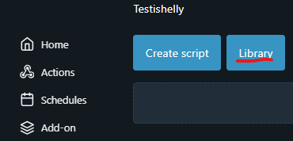

5. Aukeavassa ikkunassa paina **Configure URL**.
6. Syötä osoitteeksi `https://raw.githubusercontent.com/jisotalo/shelly-porssisahko/master/shelly-library.json` ja paina **Save**.

    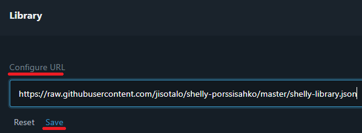

7. Nyt kirjastoon ilmestyy pörssisähköohjaus-skriptit. Asenna pääskripti (ylin) painamalla **Import code**.

    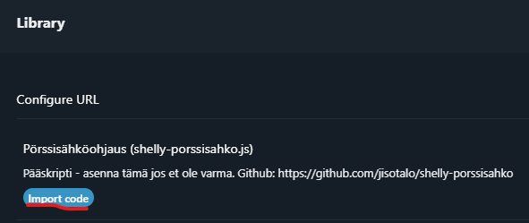

8.  Kun koodi ilmestyy, paina **Save**.

    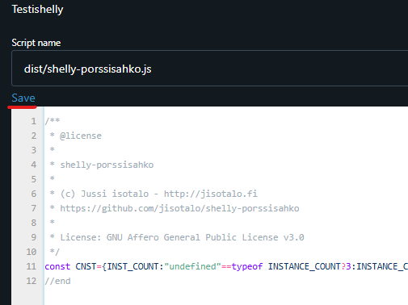

9.  Tallentamisen jälkeen laita skriptin alla konsolissa websocket debug päälle painamalla **Enable**. Tämä on tärkeää, jotta näet osoitteen ja tilatiedot käynnistyksen jälkeen. Tämä täytyy tehdä vain kerran.

    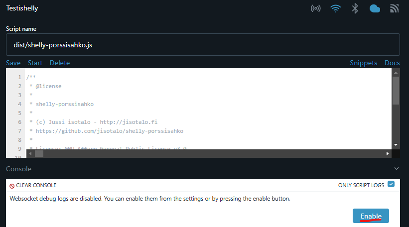

10. Paina **Start**, jolloin skripti käynnistyy

    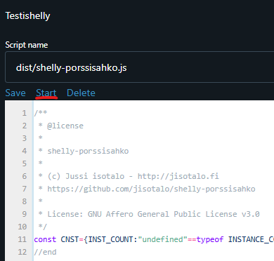

11. Nyt näet skriptin alla konsolissa hallinnan osoitteen. Kopioi tämä osoite talteen ja avaa se selaimessa uudessa välilehdessä. Osoite on muotoa `http://ip-osoite/script/1`.

    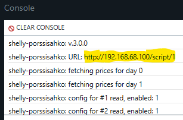

12. Siirry vielä takaisin Scripts-sivulle ja laita **Run on startup** -täppä päälle, jotta skripti käynnistyy aina Shellyn käynnistyessä.

    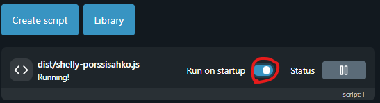

13. Valmis! Avaa käyttöliittymä selaimessa (osoite kohdassa 11) ja säädä asetukset kohdilleen [Asetukset](#asetukset)-kappaleen ohjeilla. 

### Asennus käsin

Jos haluat asentaa skriptin käsin, Shelly Smart Control -sovelluksella tai [control.shelly.cloud](https://control.shelly.cloud) -pilvipalvelun kautta, löydät skriptin osoitteesta:

[https://raw.githubusercontent.com/jisotalo/shelly-porssisahko/master/dist/shelly-porssisahko.js](https://raw.githubusercontent.com/jisotalo/shelly-porssisahko/master/dist/shelly-porssisahko.js). 

Seuraa ylläolevia ohjeita pääpirteittäin, mutta kopioi skriptin sisältö Shellyyn sellaisenaan, Library-toiminnon sijaan.

## Skriptin päivitys

Jos haluat päivittää skriptin uusimpaan versioon, poista nykyinen skripti ja tee asenna uusi **Library**-painikkeen kautta. Voit myös päivittää sen käsin asentamalla uusiksi. 

Kaikki asetukset säilyvät päivittäessä, paitsi jos päivität v.2 -> v.3.

Tarkista asennuksen jälkeen, että **Run on startup** on yhä valittu.

## Laitteisto ja sähköinen kytkentä

Itse olen ostanut laitteita [Nurkan Takaa -kaupasta](https://verkkokauppa.nurkantakaa.fi/), jonka olen todennut luotettavaksi ja järkihintaiseksi.

Jos ohjaat kontaktoria, on suositeltavaa käyttää Shellyn sinisiä laitteita tai Pro-malleja. Nämä kestävät kontaktorin aiheuttamia kytkentäpiikkejä. Esimerkkejä:

* [Shelly Plus 1](https://verkkokauppa.nurkantakaa.fi/tuote/shelly-plus-1/)
* [Shelly 1 Mini](https://verkkokauppa.nurkantakaa.fi/tuote/shelly-plus-1-mini-gen-3/)
* [Shelly Pro 1, 2 ja 3](https://verkkokauppa.nurkantakaa.fi/osasto/shelly/shelly-pro/)

Hyvää tietoa laitteista löytyy [Shelly tuki (suomeksi)](https://www.facebook.com/groups/shellytuki) -ryhmästä.

Skripti toimii **tunnetusti** ainakin seuraavilla:
  * Shelly Plus 1PM
  * Shelly Plus 2PM
  * Shelly Plus 1
  * Shelly Pro 1
  * Shelly Pro 2
  * Shelly Pro 3
  * Shelly Pro 4PM
  * Shelly Pro3EM + Switch Add-on
  * Shelly Plus UNI
  * Shelly Plus 1 Mini
  * Shelly Plus Plug S
    * Plugin valon värin ohjaus sähkön hinnan mukaan onnistuu skriptillä [shelly-plug-nordpool-light](https://github.com/jisotalo/shelly-plug-nordpool-light)


## Asetukset

Versiosta 3.0.0 lähtien skriptissä on mahdollista konfiguroida useita eri ohjauksia rinnakkain (max 3 kpl). Tämä mahdollistaa esimerkiksi usean lähdön ohjauksen eri säännöillä käyttäen monikanavaisia Shelly Pro -malleja.

Käsiteltävä ohjaus valitaan alasvetovalikosta sivun ylälaidasta. Hallinta näyttää aina valitus ohjauksen tilan, historian ja asetukset.

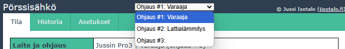

### Yleiset asetukset

Nämä asetukset ovat samat kaikille ohjauksille.


| Asetus       | Selite                                                                                                                                                                                                        | Esim. (kuva yllä)       |
| ------------ | ------------------------------------------------------------------------------------------------------------------------------------------------------------------------------------------------------------- | ----------------------- |
| Maa          | Maa, jonka sähkön hinnat haetaan                                                                                                                                                                              | `Suomi`                 |
| Sähkön ALV   | Käytettävä ALV-% sähkön hinnalle. [%]                                                                                                                                                                         | `25.5`                  |
| Siirtomaksut | Jos haluat että siirtomaksut otetaan huomioon, voit syöttää ne päivä- ja yöajalle. Nämä lisätään tuntihintoihin. [c/kWh]<br><br>Esim. jos haluat ottaa erisuuruiset siirtomaksut huomioon tuntien valinnassa. | päivä: `4` <br> yö: `3` |

Nämä asetukset ovat voimassa kaikilla ohjaustavoilla.

### Ohjauskohtaiset asetukset

Nämä asetukset ovat ohjauskohtaisia.


#### Yleiset

| Asetus            | Selite                                                                                                                                                                                                                                                                                                                                                                                                                                                                                                                                                            | Esim. (kuva yllä)                                               |
| ----------------- | ----------------------------------------------------------------------------------------------------------------------------------------------------------------------------------------------------------------------------------------------------------------------------------------------------------------------------------------------------------------------------------------------------------------------------------------------------------------------------------------------------------------------------------------------------------------- | --------------------------------------------------------------- |
| Käytössä          | Onko valittu ohjaus käytössä.                                                                                                                                                                                                                                                                                                                                                                                                                                                                                                                                     | `ON`                                                            |
| Ohjaustapa        | Millä ohjaustavalla lähtöä ohjataan.<br><br>Selitykset taulukon alapuolella.                                                                                                                                                                                                                                                                                                                                                                                                                                                                                      | `jakson halvimmat tunnit`                                       |
| Ohjattavat lähdöt | Shellyn ohjattavien lähtöjen ID-numerot.<br><br>Jos useampi lähtö, erota pilkulla (max. 4 kpl). <br><br>- Yksi lähtö  (mm. Shelly Plus 1) --> `0`.<br>- Useampi (esim 0, 1 ja 100) --> `0,1,100`                                                                                                                                                                                                                                                                                                                                                                  | `0`                                                             |
| Lähdön ohjaus     | Ohjataanko relelähtö aina haluttuun tilaan vai ainoastaan jos tila muuttuu.<br><br>- **Aina tarkistaessa:** Lähtö ohjataan joka tarkistuksen jälkeen (eli yleensä kerran tunnissa) haluttuun tilaan ja Shellyn sovelluksen tai hallintapaneelin kautta tehty muutos ylikirjoitetaan.<br>- **Vain muuttuessa:** Lähtö ohjataan ensimmäisellä kerralla haluttuun tilaan ja sen jälkeen ainoastaan sen muuttuessa.                                                                                                                                                   | `aina tarkistaessa`                                             |
| Ohjausminuutit    | Määrittää kuinka monta minuuttia tunnista ohjaus on päällä. Jos tunti on turhan pitkä aika pitää lähtöä päällä, voidaan aika muuttaa lyhyemmäksi. Asetus vaikuttaa kaikkiin ohjauksiin, pois lukien pakko-ohjaus käsin. [min]<br><br>Esim. 30 minuuttia riittää aina varaajan lämmittämiseen, joten pidetään vain tunnin ensimmäiset 30 minuuttia ohjausta päällä.                                                                                                                                                                                                | `60`                                                            |
| Käänteinen ohjaus | Jos ruksittu, ohjaus toimii käänteisesti normaaliin nähden. Tällöin lähtökohta on, että lähtö on päällä.<br><br>- **Varmuustunnit**: Lähtö ohjataan varmuustunneilla pois päältä<br>- **Hätätilaohjaus**: Lähtö on päinvastainen asetukseen nähden<br>- **Pakko-ohjaukset**: Lähtö voidaan pakko-ohjata pois päältä<br>- **Käsiohjaus**: Lähtö on päinvastainen asetukseen nähden<br>- **Hintaraja**: Jos hinta on alle rajan, lähtö asetetaan pois päältä<br>- **Jakson halvimmat tunnit**: Jos nykyinen tunti on halvimpia tunteja, lähtö asetetaan pois päältä | `ei`                                                            |
| Varmuustunnit     | Jos sähkön hintaa ei jostain syystä tiedetä, ohjataan lähtö näillä tunneilla päälle.<br><br>Esim. ongelma hintojen haussa tai nettiyhteys katkeaa.                                                                                                                                                                                                                                                                                                                                                                                                                | `01:00-07:00`                                                   |
| Hätätilaohjaus    | Jos Shelly ei jostain syystä tiedä kellonaikaa, ohjataan lähtö tähän tilaan varmuuden vuoksi.<br><br>Esim. jos sähkökatkon jälkeen nettiyhteys ei palaudu (ei hintoja eikä kellonaikaa).                                                                                                                                                                                                                                                                                                                                                                          | `ON`                                                            |
| Pakko-ohjaukset   | Voidaan määrittää tunnit, jolloin ohjaus asetetaan joko päälle tai pois riippumatta sähkön hinnasta ja muista ohjauksista (pl. pakko-ohjaus käsin).<br><br>Esim. jos haluat lämmittää varajaa joka aamu tai estää ohjauksen tiettynä osana vuorokaudesta.                                                                                                                                                                                                                                                                                                         | `05:00-07:00` ja `19:00-21:00` päällä<br><br>`01:00-02:00` pois |

#### Käsiohjaus

Voimassa, jos valittu ohjaustapa on käsiohjaus.

Käsiohjauksella lähtö ohjataan käyttöliittymältä asetettuun tilaan.


| Asetus | Selite                            | Esim. (kuva yllä) |
| ------ | --------------------------------- | ----------------- |
| Ohjaus | Asetetaanko lähtö päälle vai pois | `ON`              |

#### Hintaraja

Voimassa, jos valittu ohjaustapa on hintaraja.

Hintarajaohjauksella lähtö asetetaan päälle jos sähkön hinta on alle määritellyn rajan (tai juuri sen verran).


| Asetus    | Selite                                                                                                                                             | Esim. (kuva yllä) |
| --------- | -------------------------------------------------------------------------------------------------------------------------------------------------- | ----------------- |
| Hintaraja | Hinta, jossa ja jonka alla lähtö asetetaan päälle. [c/kWh]<br><br>Voit syöttää tähän myös arvon `avg`, jolloin käytetään päivän hinnan keskiarvoa. | `4.25`            |

#### Jakson halvimmat tunnit

Voimassa, jos valittu ohjaustapa on jakson halvimmat tunnit.

Jakson halvimmat tunnit -ohjauksella vuorokausi jaetaan osiin. Lähtö ohjataan päälle jokaisen osan halvimmmilla tunneilla. Lisäksi voidaan määrittää raja jonka alla ohjaus on aina päällä.

Vuorokausi voidaan jakaa tasaisiin osiin (esim. 8h välein) tai syöttää omat käytettävät aikavälit (esim. aamu ja ilta).


| Asetus            | Selite                                                                                                                                                                                                                                                                                                                       | Esim. (kuva yllä) |
| ----------------- | ---------------------------------------------------------------------------------------------------------------------------------------------------------------------------------------------------------------------------------------------------------------------------------------------------------------------------- | ----------------- |
| Ajanjakso         | Minkä mittaisiin jaksoihin vuorokausi jaetaan. Jokaiselta jaksolta haetaan sitten halvimmat tunnit. [h]<br><br>Vaihtoehtona on myös `oma valinta`. Tällöin kellonajat voidaan syöttää itse. Katso lisätietoa kappaleesta [Jakson halvimmat tunnit - omavalintaiset jaksot](#jakson-halvimmat-tunnit---omavalintaiset-jaksot) | `6`               |
| Tuntimäärä        | Kuinka monta halvinta tuntia lähtö ohjataan päälle ajanjakson aikana.<br><br>Eli jos ajanjakso on 6h ja tuntimäärä 2, kello 00:00-06:00 lähtö ohjataan päälle kahtena halvimpana tuntina. Kuten myös kello 06:00-12:00 ja niin edelleen.                                                                                     | `2`               |
| Peräkkäiset       | Jos käytössä, valitaan jakson tunnit siten että ne ovat peräkkäin.<br><br>Näin yksittäisiä halvimpia tunteja ei välttämättä hyödynnetä, mutta halvin mahdollinen yhtenäinen jakso otetaan käyttöön. Katso esimerkki alta.                                                                                                    | `ei`              |
| Aina päällä -raja | Jos sähkö on tätä halvempaa (tai juuri tämän hintaista) niin lähtö on aina päällä. [c/kWh]<br><br>Voit syöttää tähän myös arvon `avg`, jolloin käytetään päivän hinnan keskiarvoa.                                                                                                                                           | `-0.5`            |
| Maksimihinta      | Jos sähkön hinta on tätä korkeampi, lähtöä ei aseteta päälle vaikka tunti olisikin halvimpia tunteja. [c/kWh]<br><br>Voit syöttää tähän myös arvon `avg`, jolloin käytetään päivän hinnan keskiarvoa.<br><br>*Tämän kanssa pitää olla tarkkana, jos tulee kalliita päiviä.*                                                  | `30`              |

Alla esimerkki miten ohjaukset toteutuivat 12.10.2023 hinnoilla ja yllä olevilla asetuksilla (6h, 2 halvinta tuntia, aina päällä -raja -0.5 c/kWh). Huomaa jaksojen korostus taustavärillä.


Alla on havainnollistettu **peräkkäiset**-asetuksen vaikutusta. Esimerkkikuvissa asetuksena on 4h ajanjakso ja tuntimäärä 3.

**Ei käytössä (oletusarvo):**

Valitaan kolme halvinta tuntia.


**Käytössä:**

Valitaan kolme perättäistä tuntia. Valitaan kello 17-19 koska niiden hinnan keskiarvo on pienempi kuin kello 16-18.


### Jakson halvimmat tunnit - omavalintaiset jaksot

Asetuksiin voidaan syöttää vaihtoehtoisesti yksi tai kaksi omavalintaista jaksoa tuntimäärineen. Tämän avulla saadaan helposti tehtyä esimerkiksi "*kolme halvinta tuntia yöllä kello 00-06 väliltä ja yksi halvin tunti illalla kello 18-21 väliltä*" -tyylinen ohjaus.

Valittaessa ajanjaksoksi `oma valinta`, voidaan syöttää halutut kellonajat ja tuntimäärät alla olevan kuvan mukaisesti.


Tällöin ohjaus voisi mennä esimerkiksi seuraavasti:

 

### Toiminnot

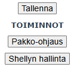

* **Pakko-ohjaus**
  * Painamalla tätä voit asettaa kyseisen ohjauksen lähdöt päälle tai pois määritellyksi ajaksi
  * Syötä kysyttäessä kuinka monta tuntia pakko-ohjaus on käytössä sekä haluttu lähdön tila (voit syöttää myös osatunteja, esim. `0.5` on puoli tuntia)
* **Shellyn hallinta**
  * Avaa uudessa välilehdessä Shellyn oman hallintasivun

## Lisätoiminnot ja käyttäjäskriptit

*Huom - tämä kappale on kesken v3 osalta!*

Skriptiä voi jatkojalostaa omalla koodilla. Alla olevat esimerkit löytyvät valmiina.

| skripti                                                                                                                                            | selite                                                                                           |
| -------------------------------------------------------------------------------------------------------------------------------------------------- | ------------------------------------------------------------------------------------------------ |
| [`shelly-porssisahko-open-meteo-api.js`](https://github.com/jisotalo/shelly-porssisahko/blob/master/dist/shelly-porssisahko-open-meteo-api.js)     | Hakee vuorokauden kylmimmän lämpötilan ja muuttaa sen perusteella halvimpien tuntien lukumäärää. |
| [`shelly-porssisahko-addon-temp-hours.js`](https://github.com/jisotalo/shelly-porssisahko/blob/master/dist/shelly-porssisahko-addon-temp-hours.js) | Muuttaa halvimpien tuntien lukumäärää Shelly Plus Addonin mittaaman lämpötilan perusteella       |
| [`shelly-porssisahko-addon-temp.js`](https://github.com/jisotalo/shelly-porssisahko/blob/master/dist/shelly-porssisahko-addon-temp.js)             | Ylikirjoittaa ohjauksen tarvittaessa Shelly Plus Addonin mittaaman lämpötilan perusteella        |
| [`shelly-porssisahko-ht-sensor-temp.js`](https://github.com/jisotalo/shelly-porssisahko/blob/master/dist/shelly-porssisahko-ht-sensor-temp.js)     | Muuttaa halvimpien tuntien lukumäärää Shelly H&T:n mittaaman lämpötilan perusteella              |


## Kysymyksiä ja vastauksia

### Miksi välillä tulee HTTP error 503?

Kun skripti hakee hintoja tai suorittaa ohjauslogiikkaa, vastataan kaikkiin HTTP-pyyntöihin 503 (Service Unavailable) muistin säästämiseksi.
Käyttöliittymä osaa hallita tämän.

Tämä virhe voi joskus tulla ja se on ominaisuus. Kokeile avata sivu uudelleen.

### Miten ohjaan ainoastaan yön halvimmilla tunneilla?

Valitse ajanjaksoksi `oma valinta (1 jakso)` ja aseta asetukset. Katso [Jakson halvimmat tunnit - omavalintaiset jaksot](#jakson-halvimmat-tunnit---omavalintaiset-jaksot).

### Miten saan lähdön päälle aina jos sähkön hinta on keskiarvon alapuolella?

Valitse ohjaustavaksi `hintaraja` ja aseta hintarajaksi arvon `avg`.

### Miksi laitteen nimen kohdalla lukee "Ei asetettu"?

Et ole asettanut laitteelle nimeä Shellyn hallinnasta. Nimen voit asettaa `Settings` -> `Device name` alta. 

Huomaa, että tehdasasetuksena nimen kohdalla lukee lukee laitteen malli. Tämä näkyy silti pörssisähköskriptille tyhjänä.

### Kuinka saa skriptin toimimaan Switch Add-Onin kanssa?

Testattu Shelly Pro3EM + Switch Add-on.

Kun olet asentanut add-onin, näet lähdön numeron Shellyn hallinnassa. Alla olevassa esimerkissä lähdön numero on `100`.


Muuta skriptin asetuksista `ohjattavat lähdöt` kyseiseen arvoon, jolloin ohjaus toimii.

### Milloin seuraavan päivän hinnat haetaan? Miksi hintoja ei näy vaikka kello on 14?

Seuraavan päivän hinnat haetaan kello 15. Elering tarjoaa uudet hinnat n. 14:30 alkaen.

### Mihin asetukset tallentuvat?

Asetukset tallentuvat Shellyn KVS-muistiin (Advanced -> KVS). 
Asetukset ovat JSON-muodossa ja voit muokata niitä vapaasti myös Shellyn hallinnan kautta. 
Skripti täytyy käynnistää uudestaan, jotta asetukset tulevat voimaan.

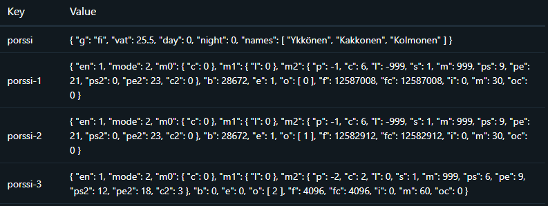

### Miksi hintatietoja ei saada?

Joskus Eleringillä voi olla ongelmia. Tämän takia on tärkeää asettaa varmuustunnit.

Tarkista Shellyn Diagnostics-loki virheilmoitusten varalta. 
Voit koittaa avata lokissa näkyvän Elering-osoitteen omassa selaimessa ja katsoa, toimiiko se.

### Miksi historia on niin lyhyt?

Kokonaishistoriaa tallennetaan ainoastaan 24 ohjauksen verran muistin säästämiseksi.

- Jos vain yksi ohjaus on käytössä, sen historiassa näkyy 24 viime ohjausta.
- Jos kaksi ohjausta on käytössä, niiden historiassa näkyy 12 viime ohjausta.
- Jos kolme ohjausta on käytössä, niiden historiassa näkyy 8 viime ohjausta.


## Teknistä tietoa

### Yleistä

* Shellyn vähäisen muistin takia monia asioita on tehty aika rumasti
* Outoja temppuja on myös tehty minimointia helpottamaan
* Jotain muuttujia on ollut pakko laittaa globaaliksi, koska Shellyn js-moottorin pino tulee nopeasti täyteen
  * esim. silmukan `i` saattaa saada ihan yhtäkkiä oudon arvon
* Lopullinen asennettava skripti on "kääntöprosessin" tulos
* Staattiset serverin tiedostot pakataan ja base64-enkoodataan
* Pääskripti minimoidaan
* Käyttää [Eleringin CSV-apia](https://dashboard.elering.ee/assets/api-doc.html#/nps-controller/getPriceAsCSVUsingGET) muistin säästämiseksi (JSON vie liikaa)
* Muistin käyttö 3.0.0 versiolla huipussaan noin 18kt (Shellyn maksimi 25kt)
  * Muille skripteille jää vielä hyvin tilaa

```
script:1: {
  id: 1,
  running: true,
  mem_used: 11900,
  mem_peak: 18116,
  mem_free: 13286
},
```
### Skriptin kääntäminen

1) Asenna Node.js 
2) Kloonaa repository ja avaa terminaali `shelly-porssisahko`-kansiossa
3) Aja komento `npm i` asentaaksesi kirjastot
2) Aja komento `npm run build` kääntääksesi projektin
3) Valmiit skriptit löytyvät `dist/`-kansiosta


## License

GNU Affero General Public License v3.0 - [LICENSE.txt](https://github.com/jisotalo/shelly-porssisahko/blob/master/LICENSE.txt)

Huomaathan, että projekti on täysin harrasteena tehty, eikä siinä ole lisenssin mukaisesti mitään takuuta. Näin ollen tekijä ei ole vastuussa jos sen käytön kanssa on ongelmia.

Käytetty välilehtiratkaisu pohjautuu esimerkkiin [täältä](https://alvarotrigo.com/blog/html-css-tabs/).